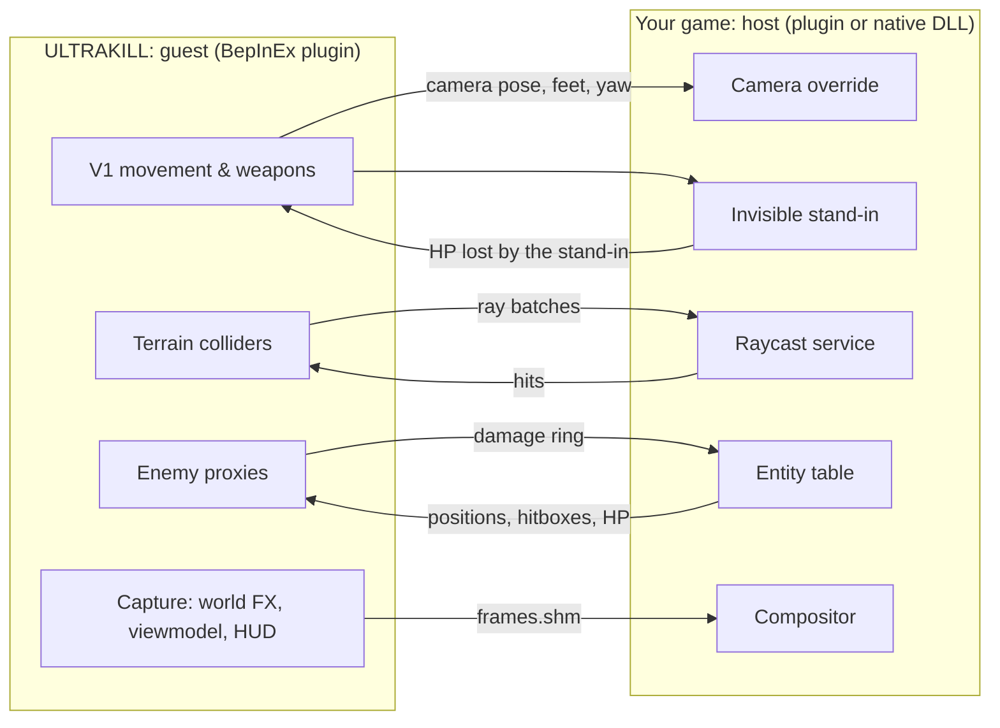

# ULTRAKILL Crossover Bridge

**Put ULTRAKILL's V1 into any other game.** A reusable kit: a ready-made ULTRAKILL guest plus the protocol, a C# host SDK and a fake host, so modders can build the *host* side for their own game.

[](#requirements)
[](docs/guest-reference.md)
[](CHANGELOG.md)
[](LICENSE)

The host game keeps its own world, enemies and saves. ULTRAKILL runs next to it and handles the player: V1's movement, dashes, slides, slams, wall jumps, every weapon, the whiplash, parries and the HUD. The host renders from V1's eyes, V1 walks on invisible colliders rebuilt from the host's own raycasts, V1's weapons hurt the host's enemies, and the host composites V1's arm, gun and HUD into its final frame. Both games stay open for the whole session.

This kit was extracted from [UltraRing](https://github.com/Themetralla3000/UltraRing) (V1 inside Elden Ring), whose ULTRAKILL side it is.

### Built on Minecraft Ring and minecraft-crossover-bridge

**The protocol and the host-side design are theirs.** [**Minecraft Ring**](https://github.com/siddoff/Minecraft-Ring) by siddoff (Minecraft running inside Elden Ring) is based on [**minecraft-crossover-bridge**](https://github.com/justbustin/minecraft-crossover-bridge) by justbustin, which defines the shared-memory protocol (`bridge_protocol.h`), the stand-in/camera-override/ray-mailbox/damage-ring design, recalls and shared life, F8 hand-over and frame compositing. This repository reuses that protocol unchanged ([`protocol/c/bridge_protocol.h`](protocol/c/bridge_protocol.h) is their file, copied verbatim with an attribution comment), mirrors it in C#, and adds the ULTRAKILL guest. Everything here is MIT licensed, and their notices are in [THIRD_PARTY_NOTICES.md](THIRD_PARTY_NOTICES.md).

> **Experimental and vibe-coded.** This project was built with AI in a simple feedback loop: describe the goal, let the code be written, try it in game, report what breaks, repeat. It has only been tried in a few places (mainly Elden Ring through Minecraft Ring's host), so expect rough edges. Offline single-player use only.

## What V1 can do in a host

If the host implements the full protocol (every item below is optional and degrades gracefully, see [writing-a-host.md](docs/writing-a-host.md)):

| Area | Behaviour |
| --- | --- |
| **Camera** | The host renders from V1's eyes every frame: position, look direction, roll and V1's field of view. |
| **Movement** | All of ULTRAKILL's movement on the host's ground: walk, slide, dash with its i-frames, jump, ground slam, slide-jump, wall jumps. 1 ULTRAKILL unit = 0.5 m by default, so V1 is 1.75 m tall (`MetresPerUnit`). |
| **Terrain** | The host's collision is sampled with its own raycasts around V1 and rebuilt as invisible ULTRAKILL colliders: floors, slopes, stairs, walls, ceilings, with look-ahead along V1's velocity and a per-zone cache on disk. |
| **Stand-in** | The host's player character stays in the world, invisible, pinned to V1's feet and facing. Enemies aggro and attack it; its HP loss is forwarded to V1. |
| **Weapons** | Revolver (all variants, headshots, coins, ricochets), shotgun, nailgun, railcannon, rocket launcher, explosions, punches and the ground slam hit host enemies through invisible hittable proxies (weak-point head included). |
| **Damage** | ULTRAKILL damage becomes a share of the enemy's max HP (default 1 ULTRAKILL health point = 60 host HP); the host plays its own hit reactions, deaths and drops. Hits on the stand-in hurt V1 by the same share; dashing through an attack dodges it. |
| **Style and blood** | Style meter, freshness, kill streaks and blood healing work on host enemies. |
| **Parry and whiplash** | Punch just before a host attack lands to parry it (heal, style, heavy damage to the attacker). The whiplash hooks any host enemy and pulls V1 to it. |
| **Shared life** | V1 dies, the stand-in dies; the stand-in dies, V1 dies; when the host respawns the character, V1 is moved there. |
| **Interactions** | The host's prompts ("Open", "Pick up"...) appear on V1's HUD; **V** performs them. |
| **Compositing** | V1's viewmodel, effects and HUD are captured with dedicated cameras and drawn by the host into its frame (with depth, if the host implements it). |
| **Control switch** | **F8** hands camera and controls back to the host (menus, map, inventory) and returns. |

## Architecture



The two processes talk through two memory-mapped files in a shared folder: `bridge.shm` (state, control, rays, entities, damage, counters) and `frames.shm` (V1's rendered layers). The guest in this repository is complete and generic; **you write the host** for your game. See [how-it-works.md](docs/how-it-works.md).

## Repository layout

| Path | Contents |
| --- | --- |
| [`protocol/c/bridge_protocol.h`](protocol/c/bridge_protocol.h) | The protocol header (Minecraft Ring's, verbatim) for C/C++ hosts |
| [`protocol/csharp/UltrakillBridge.Protocol`](protocol/csharp/UltrakillBridge.Protocol) | C# mirror: structs and constants, file mapping, bridge folder resolution, guest-side accessors (netstandard2.1) |
| [`host-sdk/csharp/UltrakillBridge.HostSdk`](host-sdk/csharp/UltrakillBridge.HostSdk) | `HostLink` and `HostFrames`: the protocol half of a C# host (netstandard2.1) |
| [`guest/UltrakillBridge.Guest`](guest/UltrakillBridge.Guest) | The ULTRAKILL BepInEx plugin |
| [`fake-host/UltrakillBridge.FakeHost`](fake-host/UltrakillBridge.FakeHost) | A fake host (WinForms) that speaks the protocol, for developing without a real game |
| [`tests/UltrakillBridge.Tests`](tests/UltrakillBridge.Tests) | Layout checks against the header, round-trip and terrain-cache tests |
| [`scripts/`](scripts) | Build, install, launch, stop |
| [`docs/`](docs) | How it works, the host-writing guide, the protocol reference, the guest reference, ULTRAKILL internals |

## Requirements

| Component | Supported setup |
| --- | --- |
| OS | Windows 10/11 x64 |
| ULTRAKILL | Current Steam build (Unity 2022.3). Your own copy; nothing from the game is distributed. |
| Build tools | .NET 8 SDK. `scripts\Build.ps1` downloads BepInEx 5.4.23.5 itself. |
| Host game | Anything you can write a plugin for, as long as it can raycast, move a character, override the camera and draw an overlay |

## Quick start with the fake host

No host game needed: the fake host is a small program that behaves like one.

```powershell
git clone https://github.com/Themetralla3000/ultrakill-crossover-bridge.git
cd ultrakill-crossover-bridge
.\scripts\Build.ps1                       # BepInEx + plugin -> dist\guest   (-UltrakillDir <folder> if not on the default Steam path)
.\scripts\Install-Guest.ps1               # winhttp.dll + a disabled doorstop_config.ini next to ULTRAKILL.exe (backed up)
.\scripts\Run-FakeHost.ps1 -WithGuest     # fake host window + ULTRAKILL as the guest
```

Click the fake host window. After a second or two V1 appears in it: walk with ULTRAKILL's keys, shoot the circling enemies, press **V** near the door, **F8** to hand control to the host window and back, **F9** for diagnostics.

`.\scripts\Stop-Guest.ps1 -All` closes both; `.\scripts\Uninstall-Guest.ps1` removes the two files from the ULTRAKILL folder. A normal Steam launch of ULTRAKILL is never affected (the Doorstop config is disabled; the scripts enable BepInEx on the command line for their launch only).

Run the tests:

```powershell
dotnet build UltrakillBridge.sln -c Release
dotnet run --project tests\UltrakillBridge.Tests -c Release
```

To publish a release artifact: `.\scripts\Build.ps1 -Package` writes `dist\UltrakillBridge-Guest-<version>.zip` (BepInEx + the plugin + the disabled Doorstop config).

## Writing a host for your game

The full guide is [**docs/writing-a-host.md**](docs/writing-a-host.md). In short, your plugin must, once per frame:

1. publish the game state (alive, feet position, zone, window rectangle) and a heartbeat;
2. apply V1's control block: override the camera, pin and hide a stand-in character at V1's feet;
3. answer raycast batches, publish an entity table, apply damage from V1 and report damage to the stand-in;
4. draw V1's layers from `frames.shm` over your final frame.

Do it in milestones (connect, camera, window, rays, entities and damage, life counters, compositing, prompts, F8), testing each against the real guest. C# hosts get most of the protocol work from the SDK:

```csharp
var link = new HostLink();
link.Open();                                      // bridge.shm in UKBRIDGE_DIR / ERMC_DIR
// every game frame, on the main thread:
link.BumpHeartbeat();
if (link.UpdateControl() && (link.Control.flags & Protocol.CtrlOverrideCamera) != 0) { /* apply camera, pin stand-in */ }
link.ServiceRays((Vector3 a, Vector3 b, out Vector3 hit) => MyRaycast(a, b, out hit));
link.PublishEntities(entities, frame);
link.WriteState(ref state);
```

C and C++ hosts include [`protocol/c/bridge_protocol.h`](protocol/c/bridge_protocol.h) and follow [docs/protocol.md](docs/protocol.md).

Existing mappings, as a reference: **Elden Ring** (Minecraft Ring's native DLL, which works with this guest unchanged) and a design for **Risk of Rain 2**, both summarised in the host guide.

## Documentation

| Document | For |
| --- | --- |
| [docs/writing-a-host.md](docs/writing-a-host.md) | Host authors: milestones, conventions, example mappings |
| [docs/protocol.md](docs/protocol.md) | The full protocol reference: tables, offsets, semantics, timeouts |
| [docs/how-it-works.md](docs/how-it-works.md) | Architecture and the guest's subsystems |
| [docs/guest-reference.md](docs/guest-reference.md) | Config keys, hotkeys, window modes, logs, troubleshooting |
| [docs/ultrakill-internals.md](docs/ultrakill-internals.md) | Research notes on ULTRAKILL for guest developers |

## Compatibility with UltraRing

The wire protocol is unchanged, so the guest still works with Minecraft Ring's unmodified Elden Ring DLL. Differences from UltraRing's guest: the plugin GUID is `dev.ukbridge.guest` (config `dev.ukbridge.guest.cfg`), assemblies and namespaces are `UltrakillBridge.*`, the window-mode override variable is `UKBRIDGE_WINDOW_MODE`, and the bridge folder also accepts `UKBRIDGE_DIR` (it wins over `ERMC_DIR`).

## Credits

- [Minecraft Ring](https://github.com/siddoff/Minecraft-Ring) by **siddoff** and [minecraft-crossover-bridge](https://github.com/justbustin/minecraft-crossover-bridge) by **justbustin** (MIT): the protocol, the host-side design and the reference Elden Ring host. See [THIRD_PARTY_NOTICES.md](THIRD_PARTY_NOTICES.md).
- [BepInEx](https://github.com/BepInEx/BepInEx) and HarmonyX for loading and patching ULTRAKILL.
- [UltraRing](https://github.com/Themetralla3000/UltraRing), where this guest was built and tried.

This is an unofficial fan project, unaffiliated with New Blood Interactive, Arsi "Hakita" Patala, or any host game's publisher. No game files are distributed. Licensed under the [MIT License](LICENSE).
