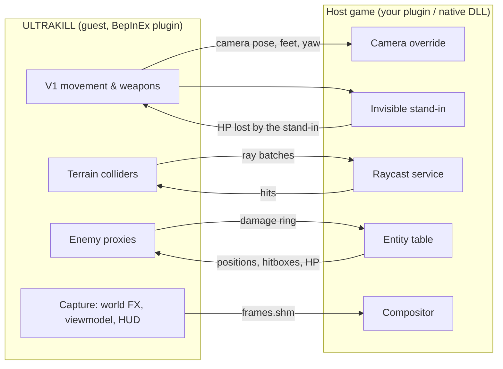

# How it works

Two complete games connected through shared memory: the **host** (your game) owns the world, its enemies and its saves; the **guest** (ULTRAKILL with the BepInEx plugin of this repository) owns the player and renders V1's arm, weapons and HUD, which the host composites into its own frame. Both stay open for the whole session.

The design is [Minecraft Ring](https://github.com/siddoff/Minecraft-Ring)'s / [minecraft-crossover-bridge](https://github.com/justbustin/minecraft-crossover-bridge)'s: the protocol, the stand-in idea, the recall/shared-life behaviour, F8 and the input window all come from there. This repository's contribution is the ULTRAKILL guest and the C# host SDK.

## Files and processes

| Piece | Where | Role |
| --- | --- | --- |
| `bridge.shm` (8 MiB) | bridge folder | State, control, rays, entities, damage, hunter events, counters. Everything except pixels. |
| `frames.shm` (~380 MiB, sparse) | bridge folder | Three slots of BGRA layers + depth, written by the guest, read by the host compositor. |
| Guest | ULTRAKILL process, BepInEx plugin | `guest/UltrakillBridge.Guest` |
| Host | your game process | Anything that implements the protocol ([writing-a-host.md](writing-a-host.md)) |

The bridge folder is `UKBRIDGE_DIR` (or `ERMC_DIR`, or `%TEMP%\ermc`). The launcher scripts set both to the same folder.

## Per-frame flow

Every ULTRAKILL frame the guest session (`BridgeSession`, run late in the frame after ULTRAKILL's camera moved):

1. **Polls the host**: `hostHeartbeat` changed within 2 s means alive; takes a seqlock snapshot of `ErmcGameState`; bumps its own heartbeat.
2. **Reads counters**: `hostLife` (recall), `hostDeaths` (V1 dies with the stand-in), `mcSwitchReq` (the host's F8).
3. **Anchors the zone** and, if needed, **recalls** V1 to where the host put its stand-in.
4. **Applies host damage** (hunter events) and runs the parry check; drains accumulated damage into V1.
5. **Ticks terrain** (ray batches in, colliders out) and **enemy proxies** (entity table in, damage ring out).
6. **Drives**: when everything is ready, builds the control block (camera, feet, yaw, flags) and publishes it, together with the captured frame when compositing.
7. **Releases** control with one flags=0 block whenever any condition is not met.

## Guest subsystems

### Session: recall, life, shared deaths

- **Zone anchor** (`CoordMap`): the first valid state per `stageId` pins the stand-in's feet to the ULTRAKILL origin. Both games are left-handed, Y-up, +Z forward, so the mapping is a translation plus the scale `MetresPerUnit` (default 0.5 m per unit, V1 = 1.75 m). When V1 gets far from the origin (5000 units) the anchor is moved to V1 and colliders are rebuilt (float precision).
- **Recall**: on attach, on a `hostLife` change, on returning from F8 and on re-anchoring, V1 is teleported (revived if dead) to the stand-in's feet with its yaw, held on a small temporary floor until host terrain exists under it (at most 4 s), and not driven for 400 ms.
- **Shared life**: V1 dies -> `mcDeaths++` -> the host kills the stand-in. The stand-in dies in the host (`hostDeaths++`) -> V1 dies. The death screen's restart revives V1 in place instead of reloading the level (which would destroy the colliders); the host decides where V1 really respawns through `hostLife`.
- **Shell**: ULTRAKILL boots straight into its sandbox scene (`uk_construct`); `LevelShell` strips every piece of level geometry, lighting volume, trigger and shop, keeping V1, its cameras, HUD and managers. The host's terrain replaces the geometry.

### Terrain from rays, with a persistent cache

`TerrainManager` builds invisible colliders from the host's ray mailbox:

- A world-aligned grid of columns (`CellSize`, 0.5 m) around V1 (`Radius`, 24 m). Each column is sampled by a low downward ray from just above V1's ground reference, a high downward ray when the low one missed (ledges taller than the headroom), and an upward ceiling ray from the floor found.
- Within 12 m of V1 and along its look-ahead path (1.5 s of velocity, up to 35 m) every cell also casts horizontal rays along its edges at knee, chest and head height in both directions; wall hits become box colliders, so thin walls and pillars are solid even though no floor ray sees them.
- Rays go out in batches (4096 at most, one in flight, nearest to V1's predicted position first); the vertical reference is the floor under V1's feet, not V1, so jumping does not re-sample the world.
- Floors are meshed per 8x8 m chunk and rebuilt only when their samples changed. A jump of more than `StepHeight` (0.6 m) between neighbouring samples becomes a wall instead of a slope, so stairs and ramps work.
- Every zone's samples are cached on disk (`<bridge dir>/terrain-cache/<zone>/`, 16x16-cell region files). Regions near V1 are loaded in the background, so revisited areas have collision instantly; cached cells are re-validated lazily (after 10 min) and when a door or lever acted.
- After an action with result 1 (door, lever) the affected area is re-sampled.

The host's synthesised normals are not used; slopes come from neighbouring heights.

### Combat: proxies, parry, whiplash

- **Proxies**: one invisible ULTRAKILL `EnemyIdentifier` with box hitboxes per hostile host entity within 80 m (a weak-point head box included), on layer 10 (or 11 with `SolidEnemies`, which makes them solid). There is no `Enemy` component and no renderer. A Harmony patch on `EnemyIdentifier.DeliverDamage` does what the original does for a Husk (hurt feedback, style, blood healing, coins) minus the missing component, then forwards the damage.
- **Damage out**: ULTRAKILL damage becomes a fraction of the entity's max HP (`HostHpPerUkHp` host HP per ULTRAKILL health point), converted to the ring's `amount` with the formula in [writing-a-host.md 5.6](writing-a-host.md#56-damage-amount-and-how-to-invert-it), one ring entry per proxy per tick.
- **Damage in**: host hunter events become `share = lost / hunterMaxHp`, scaled by `HostDamageScale`, accumulated, and applied to V1 when its hurt invincibility ends; a dash (i-frames) dodges them as in ULTRAKILL.
- **Parry**: a punch thrown within 0.25 s before (or 0.05 s after) a host hit lands, against an attacker within 6 m, turns the hit into a parry: no damage, ULTRAKILL's own parry flash, hitstop, heal and style, and the attacker takes 25 % of its max HP (8 % for bosses). Host projectiles do not exist in ULTRAKILL, so parries are melee-timed.
- **Whiplash** treats every host entity as heavy: it pulls V1 to the target.
- Style meter, freshness, kill streaks, coins and ricochets work on proxies because they go through the normal damage path.

### Capture layers (what the host composites)

`CaptureRig` renders V1's image with dedicated cameras into three transparent-background RGBA targets, every camera disabled and rendered explicitly after ULTRAKILL's camera moved:

| Layer | Content |
| --- | --- |
| world (+ depth) | Main camera's view without the (hidden) level: projectiles, explosions, gibs, particles; depth encoded OpenGL-style with `mcNear/mcFar` in host metres |
| hand | The viewmodel: the HUD camera's layer 13 (arm and weapons) |
| gui | The world-space HUD (gun, style and finish canvases) and the screen-space overlay canvas |

`FrameCapture` runs at most one capture per host frame (`hostHeartbeat` changed), issues three `AsyncGPUReadback` requests, and when they arrive writes one slot of `frames.shm`. **Only then** it publishes the control block with `mcFrame == poseId`, so the host never sees a pose without its pixels. Alpha repair modes (`WorldAlpha`, `HandAlpha`, `GuiAlpha`) fix up Unity's alpha before premultiplication. If capture is unavailable the control block is published without `COMPOSITE`.

Resolution follows the host's back buffer (`bbW/bbH`, falling back to `winW/winH`) times `CaptureScale`.

### Input window

The ULTRAKILL window must receive the keyboard and mouse while the player looks at the host. `WindowOverlay` makes it borderless, owned by the host window (so it stays above it without being topmost), positioned over the host's client rect from `winX/Y/W/H`, and almost invisible. Three techniques (`WindowMode`): `Layered` (constant opacity 1/255, the default), `Region` (full-size window clipped to one pixel) and `Tiny` (a 1x1 window). The host window is found through `hostPid` in the header. Focus is taken after showing the window and after F8 back; ULTRAKILL runs in the background so the player loop never stops while the host has focus.

### Interactions

When the host publishes a prompt ("Open door", "Pick up"...), `HostInteraction` shows it on V1's HUD. Pressing the interact key (**V** by default) increments `mcActionReq`; the host answers with `hostActionAck` and `hostActionResult`: `1` re-samples the terrain around V1, `0` flashes "nothing to do", `-2` tells the player the host needs its own controls (F8).

### F8 control switch

F8 in ULTRAKILL releases the host (flags = 0, `hostFocusReq++`), hides the input window and gives the host its camera, character and focus; F8 in the host (`mcSwitchReq++`) returns control and recalls V1 to wherever the stand-in is.

### Shutdown and crashes

The guest releases control on a clean exit, on scene changes, when the host disappears and on any exception in a frame. After a crash or kill, `scripts/Stop-Guest.ps1` (or the next `Launch-Guest.ps1`) clears the stale control block, because the reference compositor has no timeout.

## Host side

See [writing-a-host.md](writing-a-host.md). In short, the host publishes state every frame, applies the control block (camera override, pinned and hidden stand-in), services rays, publishes entities, applies damage, reports stand-in damage, and draws `frames.shm`. The C# host SDK implements the protocol part of that; the engine-facing part is the host author's.
